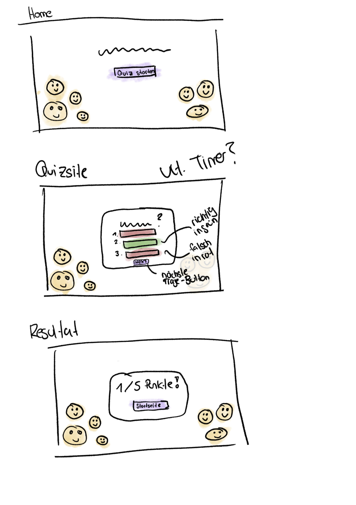

# IM5_Emoji_Quiz

## Ausgangslage und Ziel
Im Rahmen des Moduls Interaktive Medien V musste ein Web-Projekt umgesetzt werden, das thematisch in Zusammenhang mit dem Lehrprojekt und/oder der Bachelorthesis steht. Das Projekt sollte mit den in den letzten Semestern erlernten Programmiersprachen und Techniken umgesetzt werden

In meiner Bachelor-Arbeit setzte ich mich mit dem Thema Emoji-Gebrauch verschiedener Generationen in der Schweiz auseinander. Ich analysierte unter anderem, wie diese Generationen Emojis interpretieren und ob es dabei zu Übereinstimmungen oder Unterschieden kommt. Basierend auf dieser Forschung entwickelte ich als Web-Projekt ein interaktives Emoji-Quiz.

## Vorgehensweise
Nach Erhalt des Auftrags habe ich mir Gedanken gemacht, was ich als Web-Projekt umsetzen könnte. Bald kam mir die Idee für das Emoji-Quiz. Einige Elemente, wie beispielsweise der Timer, waren bereits aus dem Unterricht bekannt, und es schien mir eine kreative Möglichkeit, mein Bachelor-Thema umzusetzen.

Um ein besseres Verständnis dafür zu erhalten, welche Schritte auf mich zukommen und zur besseren Planung fertigte ich nach der Ideenenfindung Wireframes an. So entstanden Skizzen der Homepage, der Quizseite sowie der "Quiz beendet"-Meldung.

Anschliessend begann ich mit HTML die Struktur respektive die einzelnen Seiten zu erstellen und entwickelte dazu parallel mit CSS ein erstes Design. Das Kernstück meines Projekts ist das JavaScript-File. Ich baute es Schritt für Schritt mit Unterstützung von ChatGPT auf und verlieh so meinem Quiz Funktionalität. Erst nachdem die Website vollständig funktionierte, machte ich daraus zusätzlich eine Progressive Web App (PWA), indem ich die Anleitungen aus dem Unterricht und meine Notizen aus dem 4. Semester nutzte.

## Challenges und Learnings
Das Web-Projekt war eine spannende Herausforderung für mich. Interaktive Medien war in den vergangenen Semestern nicht unbedingt mein Lieblingsmodul, weshalb ich froh über die Aufgabe in diesem Semester war. Ich empfand ein Projekt als angenehmer als eine Prüfung, auch wenn es zeitaufwendiger war. Während des Projekts konnte ich mich intensiv mit den verschiedenen Programmiersprachen auseinandersetzen. HTML und CSS gingen mir recht gut von der Hand, bei JavaScript musste ich jedoch auf Ressourcen wie ChatGPT, YouTube oder W3Schools zurückgreifen. Schwierigkeiten bereitete mir die Strukturierung des Quiz. Anfangs waren die Buttons nicht an ihrem vorgesehenen Platz und lösten nicht die gewünschte Funktionalität aus, und jede Änderung schien alles zu verzerren. Chat GPT half natürlich zu einem gewissen Mass, aber durch all die Vorschläge verlor ich irgendwann den Überblick und begann dann wieder von vorne. Auch die Umwandlung meiner Website in eine PWA kostete Nerven. Obwohl ich dachte, PWAs zu verstehen, brauchte ich mehrere Anläufe. Eine weitere Herausforderung war das Thema "responsive Design".

Daraus lernte ich vor allem, dass man nicht aufgeben sollte. Viele Dinge funktionierten bei mir nicht beim ersten Versuch, was Geduld erforderte. Beim nächsten Projekt würde ich mich früher mit dem Thema "Responsive Design" beschäftigen, da dies im Nachhinein nicht so funktionierte, wie ich es mir vorgestellt hatte.

## Fazit 
Obwohl Programmieren weder zu meinen Stärken noch zu meinen Lieblingsbeschäftigungen zählt, hat mir das Projekt letztendlich sogar etwas Freude bereitet ;-). Es war ein tolles Gefühl, die fertige Website zu sehen. Zudem habe ich nun einen besseren Überblick über die Programmiersprachen und weiss, wofür jede einzelne zuständig ist.

## Quellen
- Chat GPT 4
- Coaching Samuel
- Eigene Notizen aus dem Unterricht + Slides
- YouTube
- W3Schools
